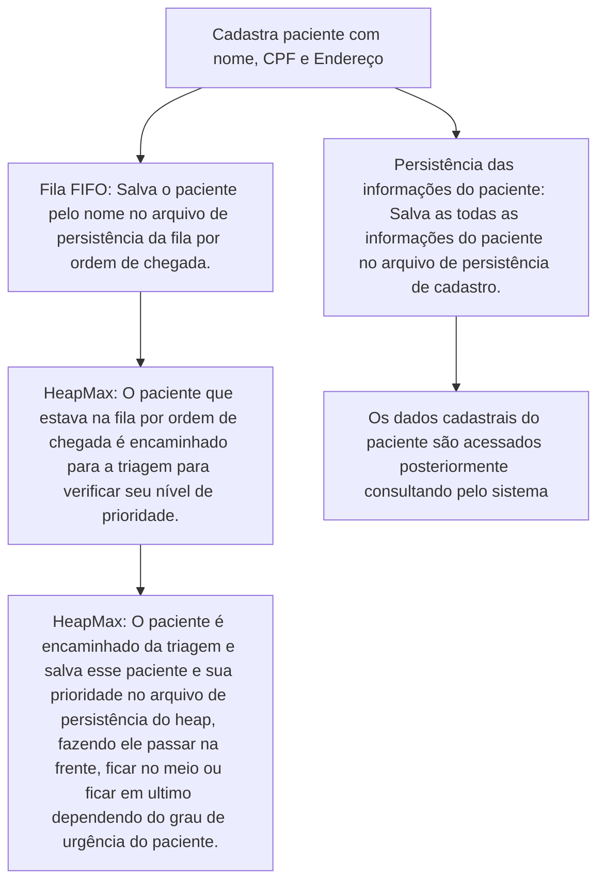

# Sobre o Projeto
* O Projeto é um sistema de atendimento por prioridade, feito inteiramente em Python e utilizando estruturas de dados como Fila (FIFO), Heap e persistência de dados em JSON.
* Funcionalidades: O sistema cadastra pacientes por ordem de chegada e suas informações, tria os pacientes de acordo com o seu nível de prioridade, consulta pacientes pelo seu grau de urgência, guarda as informações dos pacientes sendo possível consultar paciente específico e sua informação.

# Sobre as Estruturas
* O objetivo do Projeto é mostrar a interação fluída entre as duas estruturas de dados, na qual cada uma tem sua função, sendo elas:

## Fila (FIFO)
* Estrutura usada para o cadastro por ordem de chegada dos pacientes. Pacientes que chegarem primeiro, serão encaminhados primeiros para a triagem por ordem de chegada, cadastrando suas informações no sistema e os colocando na fila de triagem de acordo com os que vão chegando primeiro.
* A fila tem um limite de 10 pessoas, ao atingir o limite, a triagem deve começar imediatamente, mas pode se optar por ir triando os pacientes que estão na fila ou se atingir o limite
* Imagem de demonstração:

  

* Obs: perceba que Pedro chegou primeiro que João na fila, logo Pedro irá para a triagem primeiro


## HeapMax 
* Estrutura usada na triagem dos pacientes e definir seus níveis de prioridade, onde aqui se usa um HeapMax para definir a prioridade pelo tipo de urgência, na qual o nível de prioridade vai do maior até o menor, sendo a maior prioridade 5 e indo até menor prioridade que é 1.
* Segue a lista dos níveis de urgência baseado em níveis de prioridades usados comumente em hospitais:
  > 5 = EMERGÊNCIA - Caso gravissímo com necessidade de atendimento imediato e risco de morte.
  > 
  > 4= MUITA URGÊNCIA - Caso grave e risco significativo de evoluir para morte. Atendimento urgente
  >
  > 3 = URGÊNCIA - Caso de gravidade moderada, necessidade de atendimento médico sem risco imediato.
  >
  > 2 = POUCA URGÊNCIA - Caso para atendimento preferencial nas unidades de atenção básica.
  >
  > 1 = NÃO URGÊNCIA - Caso de atendimento básico, de acordo com horário de chegada. Queixas como crônicas, resfriados, confusões, escoriações, dor de garganta, ferimentos que não requerem fechamento e entre outros.
  
*   Para a prioridade, foi usada a biblioteca heapq, que por ser naturalmente um HeapMin, coloquei os valores instanciados como negativo para funcionar como prioridade máxima ao invés de mínima.
* Imagem de demonstração:
  
* Obs: Pedro foi triado primeiro por ter chegado primeiro na fila, porém a prioridade dele é inferior comparada a prioridade de João, que tem maior urgência, e isso é confirmado quando se consulta a lista dos pacientes por prioridade, veja aqui:

  

* Pelo fato de João ter uma prioridade maior, ele passou na frente de Pedro.

## Persistência dos dados em JSON.

* O sistema conta com uma persistência de dados feita em JSON, sustentada em três arquivos
  > Arquivo da persistência da Fila (FIFO)
  
  > Arquivo da persistência de Pacientes Cadastrados
  
  > Arquivo da persistência da HeapMax

  * O Arquivo de persistência da Fila (FIFO) salva os clientes que estão na Fila para serem triados
  * O Arquivo de persistência dos Pacientes Cadastrados salva os clientes que foram cadastrados no sistema no momento inicial do atendimento na fila por ordem de chegada, guardando as informações dos pacientes para que possam ser consultadas, como o nome, CPF e endereço.
  * O Arquivo de persistência do Heap guarda os pacientes que foram triados de acordo com sua prioridade.

  ### Como as classes FIFO e Heap se conectam para que a persistência de prioridade capte aquele cliente exato cadastrado e salvar sua prioridade no sistema?

  Um dos problemas surgidos durante a criação do sistema era como os dados dos pacientes iam se ligar para se referenciar a aquele exato paciente, e é aqui onde a mágica acontece, no arquivo `core.py`. Primeiro começa com as classes:

  * Quando inicia um atendimento, e cadastra um paciente, preenchendo suas informações, como por exemplo:
    > Nome: Maria
    
    > CPF: 12345678910
    
    > Endereço: Rua 123

    Ele salva no arquivo de persistência da Fila (FIFO) somente o nome do paciente e no arquivo de persistência do cadastro as informações junto com o nome daquele exato paciente para poderem ser consultadas posteriormente. Tudo isso no mesmo momento de execução, na mesma hora, para garantir que é aquele exato paciente e evitar duplicidade, veja aqui o exemplo no código para visualizar melhor a lógica:

`core.py:`


  ```
      nome = input("Digite o nome do paciente ou F para sair: ").upper().strip()
      if nome == "F":
        print("[bold green]Saindo[bold green]", end="")
        retisencia()
        menu()
        return
      cpf = input("Informe o CPF do paciente: ")
      if len(cpf) > 11 or len(cpf) < 11:
        print("[bold red]Digite um CPF válido![bold red]")
      else:
        endereco = input("Informe o endereço do paciente: ").upper().strip()
        fila.enqueue(nome)  #<-- salva o nome do paciente na fila
        cadastrar_paciente(nome, cpf, endereco)  #<-- salva as informações do paciente no arquivo de cadastro 
  ```

  Depois desse evento, o paciente fica na fila, e o que garante isso é a persistência de dados da própria estrutura FIFO:
  `SistemaFila.py`
  
  ```
     #init da Classe da fila, lendo e referenciando o arquivo de persistência em JSON onde vai ser salvo os objetos criados pela classe, no caso os pacientes
     def __init__(self):
        self.nome_arquivo = "persistencia_fila.json"
        try:
           f =  open(self.nome_arquivo, "r")
           self.items = json.load(f)
           f.close()
        except FileNotFoundError:
            self.items = []

     #método de salvar da Classe, é aqui onde salva os pacientes no arquivo de persistência da Fila
     def _salvar(self):
        with open(self.nome_arquivo, "w", encoding="utf-8") as archive:
            json.dump(self.items, archive, indent=4, ensure_ascii=False)
```

* Esse processo é crucial para garantir que o sistema guarde o paciente e seus dados, caso o sistema feche e os dados não sejam perdidos

* Depois daqui iremos para a parte de triagem, e por isso que o nome do paciente é salvo na persistência da fila, porque quando o paciente for triado, o Heap vai salvar o nome daquele exato paciente que estava na fila, cujo esse exato paciente teve seus dados cadastrados no arquivo de persistência de cadastro, garantindo um fluxo de dados que garante que aquele paciente é aquele exato paciente e não haja duplicidade de dados, veja o exemplo aqui no código:

`core.py`

```
    if fila.size() == 0: 
            print("[bold green]Sem pacientes na fila para exibir.[bold green]")
            menu()
            return
        else:

            ultima_pessoa = fila.peek()  #garante que a última pessoa na fila a ser chamada é a que está no topo da fila
            print("[bold green]-------[bold green]")
            print("[bold green]TRIAGEM[bold green]")
            print("[bold green]-------[bold green]")
            print(f"PRÓXIMO PACIENTE: {ultima_pessoa}")
            time.sleep(5)
            print("[bold red]5 = EMERGÊNCIA - Caso gravissímo com necessidade de atendimento imediato e risco de morte.[bold red]")
            print("[orange1]\n4 = MUITA URGÊNCIA - Caso grave e risco significativo de evoluir para morte. Atendimento urgente.[orange1]")
            print("[yellow]\n3 = URGÊNCIA - Caso de gravidade moderada, necessidade de atendimento médico sem risco imediato.[yellow]")
            print("[bold green]\n2 = POUCA URGÊNCIA - Caso para atendimento preferencial nas unidades de atenção básica.[bold green]")
            print("[blue1]\n1 = NÃO URGÊNCIA - Caso de atendimento básico, de acordo com horário de chegada. Queixas como crônicas, resfriados, confusões, escoriações, dor de garganta, ferimentos que não requerem fechamento e entre outros.[blue1]")
            try:
                prioridade = int(input("Digite o nível de prioridade do paciente ou qualquer letra para voltar para o MENU: "))
                fila.dequeue()  #aqui acontece a triagem, o paciente sai da fila
                heapMax.inserir(ultima_pessoa, prioridade)  # e o heap pega essa pessoa que saiu da fila, que era a que estava no topo da fila, e salva ela e sua prioridade
                print("[bold green]Paciente triado com sucesso para o atendimento.✅[bold green]")
```

Aqui no código da classe do Heap podemos ver com detalhes como esse paciente é salvo na persistência do heap, garantindo que sua informações de prioridade possam ser consultadas posteriormente:
`SistemaHeapFila.py:`
```
  #init da classe do heap, lembrando que estamos usando a biblioteca heapq para implementar o heap, mas fazendo uma conversão de opostos já que heapq é nativamente um heap mínimo
  def __init__(self):
        self.nome_arquivo = "pacientes_prioridade.json"
        try:
            f = open(self.nome_arquivo, "r") #aqui ele lê o arquivo json onde vai salvar os pacientes
            self.heap = json.load(f)
            f.close()
            self.heap = [tuple(x) for x in self.heap]
            #cria como tupla para poder usar o heappop e heappush do heapq, já que esses métodos não funcionam com listas de listas e sim com listas de tuplas
            #salvando também o contador para manter a ordem de chegada dos pacientes e salvar a prioridade no arquivo json
            self.contador = 0
        except FileNotFoundError:
            self.heap = []
            self.contador = 0

   #o método de salvar que vai garantir que o paciente seja salvo no arquivo de persistência
   def _salvar(self):
        with open(self.nome_arquivo, "w", encoding="utf-8") as f:
            json.dump(self.heap, f, indent=4, ensure_ascii=False)


```

* Esse processo é crucial para garantir que os pacientes salvos seja o exato paciente que estava na Fila por ordem de chegada (FIFO) e também implementar a prioridade no arquivo de persistência do heap, para que as prioridades de cada paciente passe na frente baseando-se na prioridade de maior urgência


# Conexão entre as persistências os dados dos pacientes cadastrados e suas prioridades

Para relembrar a conexão entre as classes que faz a ponte entre os arquivos de persistência, no momento em que um paciente é triado e classificado com sua prioridade, como vimos, por baixo dos panos o paciente que estava no topo da fila, no caso o primeiro por ordem de chegada, é adicionado no Heap, o inserindo na lista de pacientes triados classificados por seu nível de prioridade. Só pelo detalhe que o primeiro paciente que chegou por ordem de chegada é inserido no Heap quando está para ser triado, fortifica mais ainda que os pacientes cadastrados são únicos e, na consulta de seus dados e de suas prioridades garanta que esteja apontando para o mesmo paciente. E o que garante isso 100% é na funcionalidade de remover paciente. Quando remove um paciente do sistema, se informa o índice do paciente que deseja remover, e quando remove, apaga o paciente referenciado pelo índice passado, tanto no arquivo de persistência dos dados cadastrais, tanto do arquivo de persistência de prioridade o que garante 100% que aquele paciente é o mesmo e único no sistema.
* Abaixo podemos ver exemplo de como está no código quando quer excluir um paciente do sistema:

  `core.py:`
    ```
      remocao = int(input("Digite o índice do paciente que deseja remover: ")) - 1
                        dados2.pop(remocao)
                        remocao = heapMax.remover()
                        salvar_dados()
                        print("[bold green]Paciente removido com sucesso. ❌[bold green]")
    ```


  

* Partindo desses conceitos importantes para o funcionamento do sistema, fluxo fica assim:





Com esse fluxo, fica fácil de se ver como cada Classe se conecta e como cada persistência age garantindo na ligação fluída dos dados e garantindo que aquele paciente não seja duplicado e seja único no sistema.


# Como rodar
* Garanta que sua máquina tenha o Python a partir da versão 3.13

* Instale a biblioteca rich:

```bash
pip install rich
```

* Baixe o arquivo do repositório e execute no terminal: `python core.py`


# Conclusão:
* Esse projeto tem como objetivo mostrar como estruturas e persistência de dados se conectam em uma aplicação Python para entregar um produto viável e real, que garanta a unicidade desses dados em tempo real de forma simples.
* O ponto central que une essas estruturas e persistências é a forma fluída como esses dados vão sendo recebidos pelas classes como um trânsito tranquilo em movimento.
